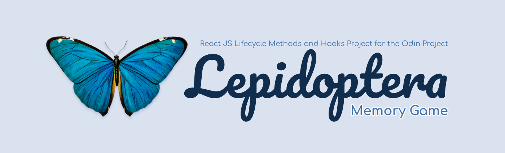
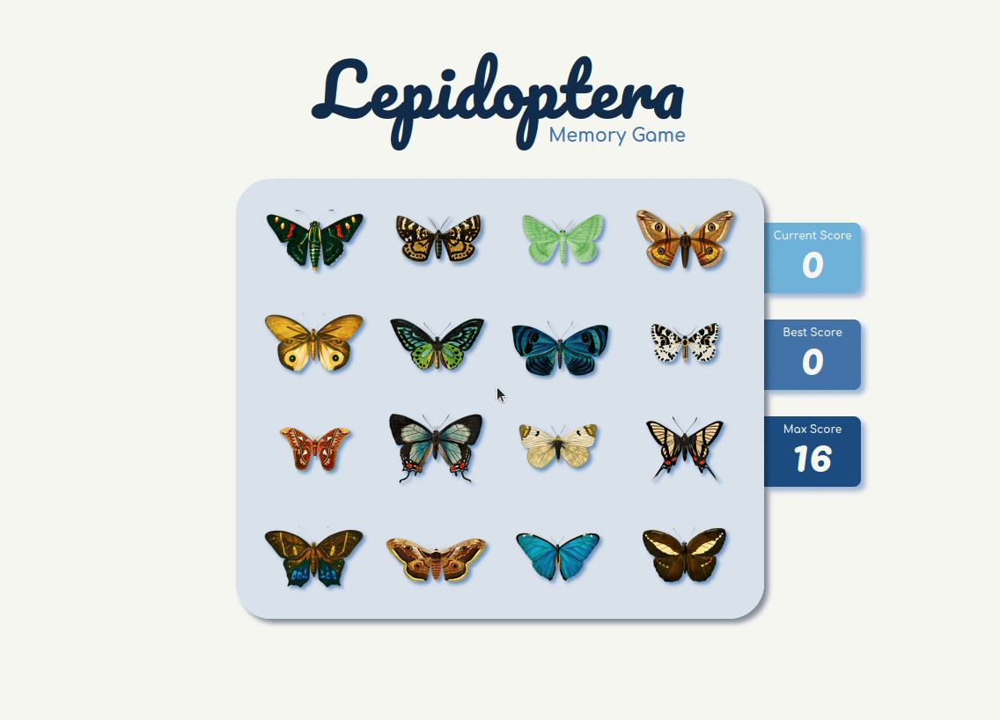

# Memory Game
A project built for [The Odin Project Ruby on Rails Course](https://www.theodinproject.com/paths/full-stack-ruby-on-rails/courses/javascript/lessons/memory-card) to implement techniques using ReactJS lifecycle methods and hooks. 

## Features
The game shuffles the images after every click of a butterfly and keeps track of how many unique butterflies have been clicked as the score. If the same image is clicked twice, the game is over and the board is reset. The user can try to beat their previous score, but only better scores will replace the existing high score.

## Demo
Check out the live version [here](https://zxum.github.io/memory-game/)

## Image Credits 
All images are from [rawpixel](https://www.rawpixel.com)

## Reflections
Honestly, the hardest part of the project wasn't the coding or using lifecycle methods and hooks. It was figuring out what kind of images I wanted to use! Once I got the images, everything else fell into place. 

As usual, I started by creating a mockup in Figma, which shaped how I wanted the page to look. I broke down all the different features I wanted to implement such as the shuffling of images, and the score counting. Then I went to work! It's a fun little game, and I enjoy playing it myself, though I have yet to beat it! 